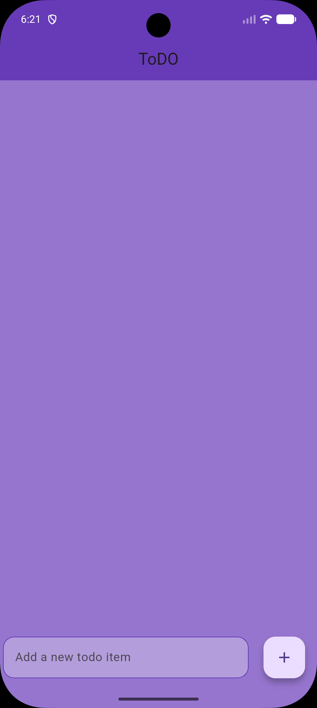
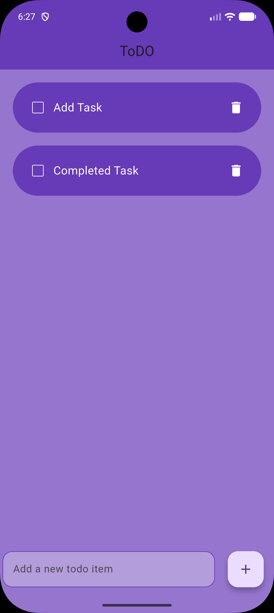
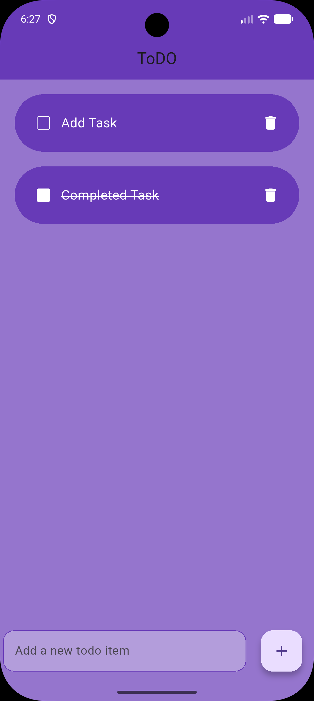

# Flutter Todo App

A lightweight **Todo application built with Flutter** that allows users to manage tasks locally.
The app supports creating, completing, and deleting tasks with persistent storage using **Hive**, ensuring tasks remain saved even after the application is closed.

## Overview

This project demonstrates the fundamentals of Flutter application development, including:

- Stateful UI management
- Widget composition
- Local data persistence
- Separation of UI components
- Basic mobile application architecture

The application is designed as a simple productivity tool while also serving as a learning project for Flutter and Dart development.

---

## Screenshots

Below are example screenshots of the application interface.

| Home Screen | Task Added | Task Completed |
|-------------|------------|---------------|
|  |  |  |

Example project structure:

```text
screenshots/
 ├─ home.png
 ├─ add_task.png
 └─ completed_task.png
```

---

## Features

- Add new tasks
- Mark tasks as completed
- Delete existing tasks
- Persistent local storage using Hive
- Simple and responsive user interface

---

## Tech Stack

| Technology  | Purpose                                    |
| ----------- | ------------------------------------------ |
| **Flutter** | Cross-platform UI framework                |
| **Dart**    | Application programming language           |
| **Hive**    | Lightweight local database for persistence |

---

## Project Structure

```text
lib/
 ├─ home_page/
 │   └─ home_page.dart
 │
 ├─ utils/
 │   └─ todo_list.dart
 │
 └─ main.dart
```

### Key Components

- **main.dart**
  Application entry point. Initializes Hive and launches the main app.

- **home_page.dart**
  Contains the main UI and application logic for managing todo items.

- **todo_list.dart**
  A reusable widget representing an individual todo item, including checkbox state and delete functionality.

---

## Data Model

Todos are stored in Hive as a simple list structure:

```text
["Task description", false]
```

Where:

- `String` → Task title
- `bool` → Completion status

---

## Getting Started

### 1. Clone the repository

```bash
git clone https://github.com/YOUR_USERNAME/YOUR_REPOSITORY.git
```

### 2. Navigate to the project directory

```bash
cd YOUR_REPOSITORY
```

### 3. Install dependencies

```bash
flutter pub get
```

### 4. Run the application

```bash
flutter run
```

---

## Building the APK

To build a release APK for installation on Android devices:

```bash
flutter build apk
```

The compiled APK will be available at:

```text
build/app/outputs/flutter-apk/app-release.apk
```

---

## Future Improvements

Potential enhancements for future development:

- Task editing functionality
- Swipe-to-delete gestures
- Animations for task creation and completion
- Material 3 design improvements
- Cloud synchronization for cross-device task management

---

## License

This project is open source and available under the **MIT License**.
